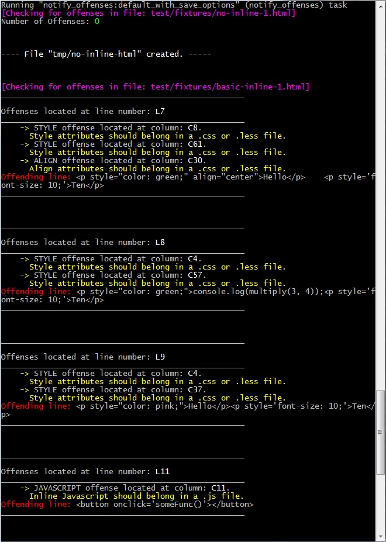

# grunt-notify-offenses

> Searches through a list of files and notifies on all declarative inline offenses.

 

## Getting Started
This plugin requires Grunt `~0.4.1`

If you haven't used [Grunt](http://gruntjs.com/) before, be sure to check out the [Getting Started](http://gruntjs.com/getting-started) guide, as it explains how to create a [Gruntfile](http://gruntjs.com/sample-gruntfile) as well as install and use Grunt plugins. Once you're familiar with that process, you may install this plugin with this command:

```shell
npm install grunt-notify-offenses --save-dev
```

Once the plugin has been installed, it may be enabled inside your Gruntfile with this line of JavaScript:

```js
grunt.loadNpmTasks('grunt-notify-offenses');
```

## The "notify_offenses" task

### Overview
In your project's Gruntfile, add a section named `notify_offenses` to the data object passed into `grunt.initConfig()`.

```js
grunt.initConfig({
  notify_offenses: {
    options: {
      // Task-specific options go here.
    },
    files: {
      // Target-specific file lists and/or options go here.
    },
  },
})
```

## Options

#### save
Type: `Boolean` _optional_
Default value: `false`

Determines if the output should be sent to both standard output **and** an output file. If set to `true`, then the result will be printed in the terminal and also be written into a new file specified in the files property.

_____________________________
###Finder Options

#### override
Type: `Boolean` _optional_
Default value: `false`

Determines if the user-defined offenses will override the pre-defined offenses given that their types are equivalent, regardless of case. For example, if the type of a user-defined offense is "Style", and the override option is set to `true`, then the pre-defined "Style" offense will be overridden. Keep in mind that overriding will **ONLY** work if the user-defined offense has both a type **and** a valid pattern, else it will fall back to the pre-defined offense of the same type.

If **override** is set to `false`, then the pre-defined offenses will have priority.

#### force
Type: `Boolean` _optional_
Default value: `true`

Determines if the pre-defined offenses are also evaluated along with the user-defined offenses. If set to `true`, the pre-defined offenses are also considered in the search along with the user-defined offenses, else they are not when set to `false`. The option **force** is implied to be `true` if the user-defined offenses are undefined.

#### offenses
Type: `Object Literal` _optional_
Default value: `{}`

Contains each user-defined offense. The key of each entry is the offense type and the value is another object literal that contains a `String` message and an `Array` pattern. The pattern itself should have the regular expression at the first index, and at every subsequent index is a regex modifier.

```js
  notify_offenses: {
    options: {
      offenses: {
        'type': {
          message: 'message',
          pattern: ['pattern', 'modifier 1',...,'modifier n'],
          extentions: ['extension 1',....,'extension n']
        }
      }
    }
  }
```
#####User-Defined Offense Options

######Type
Type: `String` **required**

The type is case-insensitive, so 'Style' and 'STYLE' are considered the same type.

######Message
Type: `String` _optional_

The message **must** be a `String` value, else it will default to a string consisting of a single '\s' character.

######Pattern
Type: `Array` _optional_

> **pattern: ['regex pattern', 'regex modifier 1',.....,'regex modifier n']**

The pattern uses the regexp function, so special characters **must** be double escaped. The only exceptions are single and double quotes, which can be single escaped and handled. The regex modifiers supported so far are:

* `global` Searches for _all_ matches of the pattern rather than the first match found. Can be entered as *global* or *g*.
* `case-insensitive`  Searches for a match of the pattern regardless of the alphabetical case. Can be entered as *case-insensitive* or *i*.

**All** entries in the pattern array **MUST** be a `String`.

######Extensions
Type: `Array` _optional_

> **extensions: ['extension 1',......,'extension n']**

The extensions array uses the user-defined `String` extensions to compare to the extension of each file being processed, and if there is a match, the operation will continue. This is used to filter out files where certain offenses do not pertain to. An empty or undefined **extensions** would default to the plugin searching **ALL** of the list of files to process for the offense.

**All** entries in the extensions array **MUST** be a `String` and should **NOT** include the '\.' character of the file extension.

#####List of Pre-Defined Offenses

* `'STYLE'` Searches for inline _style_ offenses in a file. This search is _case-insensitive_ and _global_ and only searches through \*.html files.
> **<p align='center'\>Paragraph</p\>**

    ...is an offense.

* `'ALIGN'` Searches for inline _align_ offenses in a file. This search is _case-insensitive_ and _global_ and only searches through \*.html files.
> **<p style='color: green;'\>Paragraph</p\>**

    ...is an offense.

* `'JAVASCRIPT'` Searches for inline _javascript_ offenses in a file. This search is _case-insensitive_ and _global_ and only searches through \*.html files.
> **<button onclick='someFunction()'\>Button</button\>**

    ...is an offense.


_____________________________
###Assembler Options

#### tabwidth
Type: `Number` _optional_
Default value: `4`

Removes all tab characters at the beginning of each line from the file input and replace them with a new tabwidth, normalizing the data. It is highly recommended to equate the tabwidth to the tabwidth rule of jshint for full accuracy of the column numbers.

_____________________________
###Reporter Options

#### stout
Type: `String` _optional_
Default value: `'plaintext'`

Determines how the output will be printed through standard output.

* `'plaintext'` Outputs the results in a plaintext UTF-8 format.
* `'decoratedplaintext'` Outputs the results in a plaintext format with color and emphasis on key details.
* `'minimalxml'` Outputs the results in a very basic XML format.
* `'json'` Outputs the results in a JSON format that follows the ECMA5 standard.

#### output
Type: `String` _optional_
Default value: `'plaintext'`

Determines how the output will be written to an output file.

* `'plaintext'` Outputs the results in a plaintext UTF-8 format.
* `'decoratedplaintext'` Outputs the results in a plaintext format with color and emphasis on key details.
* `'minimalxml'` Outputs the results in a very basic XML format.
* `'json'` Outputs the results in a JSON format that follows the ECMA5 standard.

#### cleaner
Type: `String` _optional_
Default value: `'none'`

Cleans each line of the output file(s) of whitespaces based on a given option:

* `'none'` Does not clean each line.
* `'trailing'` Cleans each line of all whitespace at the beginning and end of the line.
* `'all-tabs'` Cleans each line of all '\t' whitespace.
* `'all-spaces'` Cleans each line of all '\s' whitespace.
* `'all'` Cleans each line of _all_ whitespace.

## Usage Examples

### Default Options
In this example, the default options are used to look for offenses in a set of files. So with `'tmp/inline-result'` as my destination and `'test/fixtures/inline1.html'` as my source, the plugin does the following:

* Takes in the source file's filepath and data.
* Rearranges all tab characters at the front of each line to a **tabwidth** of `4`.
* Searches through the pre-defined list of offenses for any offending columns. Since no **offenses** were defined by the user and **override** is set to `false` and **force** is set to `true`, then the pre-defined offenses will all be checked and not overriden. Additonally, the plugin will search for offenses in **ALL** files since **extensions** was no defined.
* The **cleaner** defaults to `'none'`, so it does not clean the lines of the output of any whitespace and keeps the default formatting.
* Outputs the offending data to the standard output (**stout**) in `'plaintext'` format. Since **save** is set to `false`, the offending data will not be considered to be written to an output file and the **output** option and the destination is ignored.

```js
grunt.initConfig({
  notify_offenses: {
    default: {
      options: {
        save: false,
        stout: 'plaintext',
        output: 'plaintext',
        override: false,
        offenses : {},
        force: true,
        tabwidth: 4,
        cleaner: 'none'
      },
      files: {
        'tmp/inline-result': ['text/fixtures/inline1.html']
      },
    }
  }
})
```

### Only User-Defined Offenses From \*.html Files Written to File in XML Format
In this example, the user only wants their defined offenses to be considered and then have the output written to a file. So with `'tmp/inline-result'` as my destination and `'test/fixtures/inline1.html'` as my source, the plugin does the following:

* Takes in the source file's filepath and data.
* Searches through the user-defined offenses first since there are defined **offenses** by the user. Since **extensions** is defined in **offenses** and has an extension `html`, then **ONLY** \*.html files will be searched.
* Since **override** is set to `true` and **force** is set to `false`, then not only would the pre-defined offenses be overriden, but they will also not be checked (_Note: the exception is that if there is a user-defined offense that only has a type name and nothing else, then it will default to the matching type in the pre-defined offenses if it exists_). In this case, as "Style" exists as a pre-defined offense, then the pre-defined "Style" will be overriden and the user-defined offense will take its place in the results.
* Outputs the offending data to the standard output in the default `'plaintext'` format. Since **save** is set to `true` and **output** is set to `'minimalxml'`, the offending data will be written to the `'tmp/inline-result'` file (the file will be created if it does not exist) in the XML format.

```js
grunt.initConfig({
  notify_offenses: {
    default: {
      options: {
        save: true,
        output: 'minimalxml',
        override: true,
        offenses : {
          "Style": {
            message: "message",
            pattern: ['pattern, 'modifier'],
            extensions: ['html']
          },
          "Unique-Offense": {
            message: "message.",
            pattern: ['pattern', 'modifier', 'modifier'],
            extensions: ['html']
          }
        },
        force: false
      },
      files: {
        'tmp/inline-result': ['text/fixtures/inline1.html']
      },
    }
  }
})
```

### Only Offense Type Subset to Standard Output in JSON
In the _Offense Type Subset_ configuration, the plugin will **only** search for matching types between the pre-defined and user-defined offenses, given that **offenses** is not empty and consists of only matching types. The pattern used is determined by if the user-defined offense is fully defined or not. So with `'tmp/inline-result'` as my destination and `'test/fixtures/inline1.html'` as my source, the plugin does the following:

* Takes in the source file's filepath and data.
* Searches through the user-defined offenses first since there are defined **offenses** by the user. Additonally, the plugin will search for offenses in **ALL** files since **extensions** was no defined.
* Since **override** is set to `true` and **force** is set to `false`, then not only would the pre-defined offenses be overriden, but they will also not be checked. _However_, an exception applies here where the user-defined offenses has matching types to the pre-defined offenses. Two seperate cases happens in this particular example:
    * The "Style" user-defined offense has no defined pattern, so the plugin searches for the matching type in the pre-defined offenses and uses corresponding pattern from that type.
    * The "ALIGN" user-defined offense is fully defined, so the plugin overrides the matching type in the pre-defined offenses.
* Outputs the offending data to the standard output (**stout**) in `'json'` format. Since **save** is not defined and thus is defaultly set to `false`, the offending data will not be considered to be written to an output file and the destination is ignored.

```js
grunt.initConfig({
  notify_offenses: {
    default: {
      options: {
        stout: 'json',
        override: true,
        offenses : {
          "Style": [],
          "ALIGN": {
            message: "message.",
            pattern: ['pattern', 'modifier', 'modifier']
          }
        },
        force: false
      },
      files: {
        'tmp/inline-result': ['text/fixtures/inline1.html']
      },
    }
  }
})
```

##In Progress and Consideration
All items of this list are ordered by greatest importance to least importance.

1. Right now the searches are on a per-line basis. So if a declaration with an offense extends to another line using a newline feed and splits the offense, then that offense may not be detected. Therefore, I am in the progress of making the search occur in reasonable chunks rather than by lines.

2. Robust error checking to degrade gracefully.

3. Developing the API for the parsers so that users can define their own parsers.

4. The addition of more useful pre-defined offenses.

5. The addition of more output formats.

6. Allowing users more control in the order of their output.


## Release History
* **0.1.00**  -  11 November 2013  - First version **alpha** phase, although I would argue that it is incredibly messy right now.